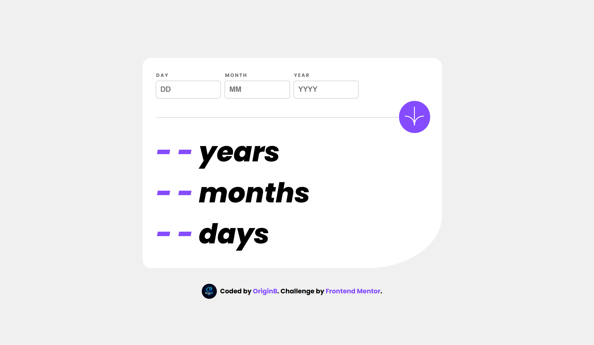
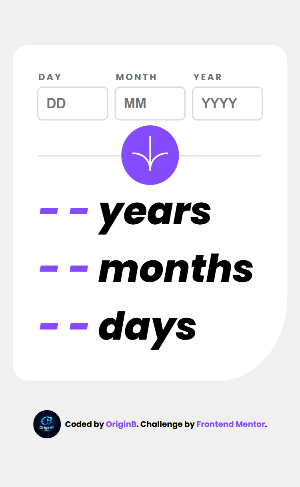

# Age Calculator

A responsive age calculator that computes the exact number of years, months,
and days between a given birthdate and today.

## 🔗 Live Demo

[Click Here](https://origin-b.github.io/Frontend-Challenges-JS/AgeCalculatorApp)

## 📸 Preview

## ✨ Features

- Calculates exact age in years, months, and days
- Full input validation with descriptive error messages
- Auto-focus between inputs for better UX
- Saves last result using localStorage
- Fully responsive (mobile & desktop)

## 🛠️ Built With

- HTML5
- CSS3 (CSS Variables, Flexbox)
- Vanilla JavaScript (my first JS project! 🎉)

## 📚 What I Learned

This was my first JavaScript project. I learned:

- DOM manipulation and event listeners
- Form validation logic
- Date calculations and handling negative values
- localStorage for data persistence
- Writing clean, reusable functions

## 🚧 What I'd Improve Next

- Add animation to the numbers when they appear
- Recalculate age on page load instead of showing saved result

## 🎯 Challenge

This project is a solution to the
[Age Calculator Challenge](https://www.frontendmentor.io/challenges)
by Frontend Mentor.

## 👤 Author

- GitHub: [@Origin-B](https://github.com/Origin-B)
