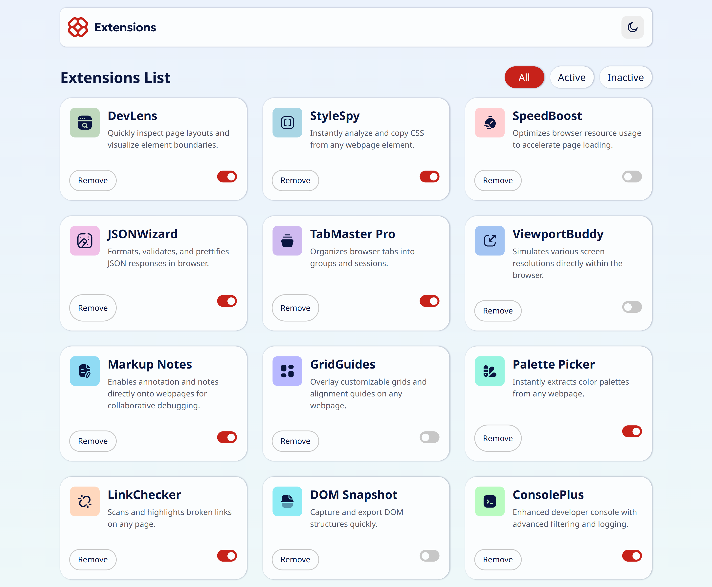
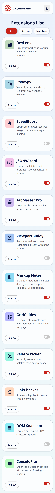
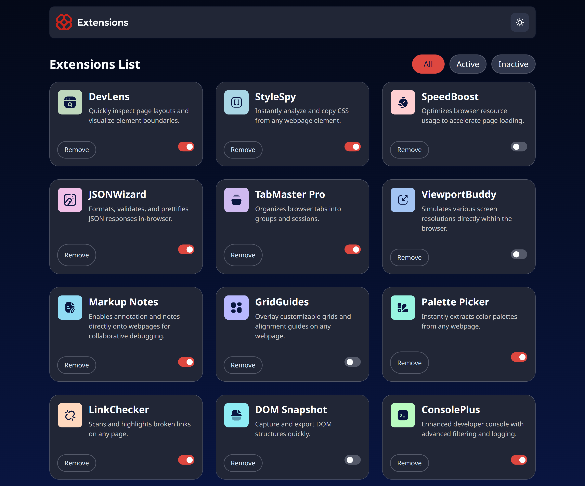
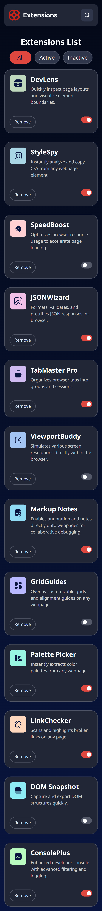

# 🌐 Browser Extensions Manager

A modern, high-performance dynamic dashboard built with Vanilla JavaScript and Tailwind CSS v4 to manage browser extensions. This project focuses on DOM efficiency, clean architectural patterns, and production-ready optimization.

---

## 📸 Screenshots & Interface

### ☀️ Light Mode



### 🌙 Dark Mode



---

### Links
- Solution URL: [GitHub Repository](https://github.com/Origin-B/Frontend-Challenges-JS/tree/main/BrowserExtensionsManager) 
- Live Site URL: [GitHub Pages](https://origin-b.github.io/Frontend-Challenges-JS/BrowserExtensionsManager/)

---

## ✨ Key Features

* **Dynamic Data Rendering:** Asynchronously fetches layout configuration from a local JSON dataset.
* **Optimized Filtering System:** Implements global memory caching to filter states (`All`, `Active`, `Inactive`) instantaneously without repetitive server requests.
* **High-Performance Event Delegation:** Utilizes a single global listener on parent components to manage actions (`Remove` and `Status Toggle`), minimizing memory leaks and maximizing runtime performance.
* **Modern CSS Grid Layout:** A responsive, robust CSS Grid structural implementation that gracefully auto-adjusts fluidly when items are dynamically deleted from the DOM.
* **Native Dark Mode v4 Configuration:** Implements Tailwind CSS v4 native variant tracking on the root HTML element (`document.documentElement`).

---

## 🛠️ Tech Stack & Concepts Applied

* **HTML5 & Semantic Elements:** Structured utilizing modern access-friendly semantic trees.
* **Tailwind CSS v4:** Heavy utilization of native CSS `@theme` variables, utility layer extensions (`@utility`), and advanced root selectors.
* **Vanilla JavaScript (ES6+):** Async/Await API integration, Array-mapping methods (`filter`, `forEach`), and manual state synchronization.
* **DOM Management:** Clean target querying via `e.target.closest()`, avoiding redundant parent node nesting to maintain optimal DOM layout tree execution.

---

## 📦 Project Structure

```text
├── index.html          # Core user interface structure
├── input.css           # Tailwind source configuration, variants & utilities
├── output.css          # Compiled production-ready stylesheet
├── index.js            # Optimization-focused application logic
├── data.json           # Local database layout mocking extensions data
└── screenshots/        # Directory containing UI presentation images
    ├── light-desktop.png
    ├── dark-desktop.png
    └── mobile-view.png