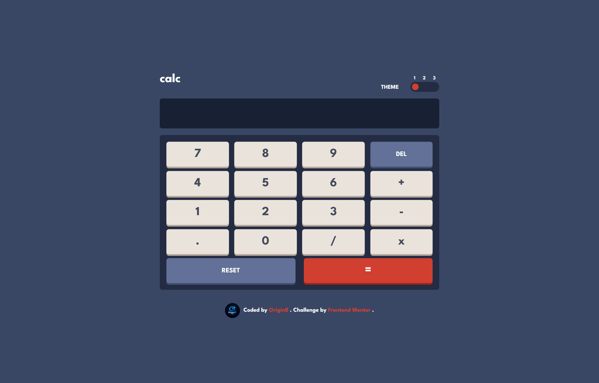
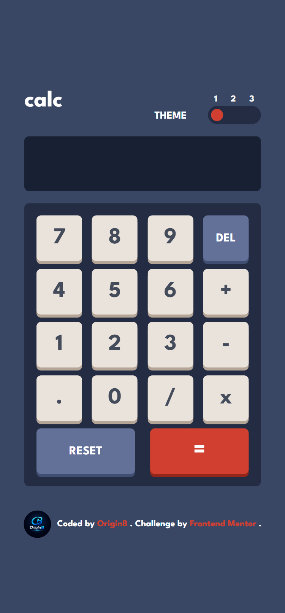

# Calculator App

A responsive calculator app built as a solution to the [Frontend Mentor](https://www.frontendmentor.io) "Calculator app" challenge, featuring three switchable color themes.

🔗 **Live Demo:** (https://origin-b.github.io/Frontend-Challenges-JS/CalculatorApp/)

## 📸 Screenshot




## 🚀 Overview

This project recreates a fully functional calculator with custom state management written in vanilla JavaScript (no `eval()`), plus a theme switcher that toggles between three distinct color schemes using CSS custom properties.

### Built with

- **HTML5** — semantic markup
- **Tailwind CSS v4** — utility-first styling, using the new `@theme` CSS-first configuration
- **Vanilla JavaScript** — calculator logic and theme switching
- **Google Fonts** — League Spartan

## 📂 Project Structure

```
.
├── index.html      # Markup
├── index.js        # Calculator logic + theme switcher
├── input.css       # Tailwind source (theme tokens + CSS variables per theme)
└── output.css      # Compiled Tailwind CSS
```

## ✨ Features

- Full calculator operations: addition, subtraction, multiplication, division
- Decimal point handling with input validation
- Delete (single digit) and Reset (clear all) functionality
- Live formatted display with thousand separators (`toLocaleString`)
- Three switchable themes via CSS custom properties (`.theme-1`, `.theme-2`, `.theme-3`)
- Animated toggle indicator that slides between theme options
- Fully responsive layout (mobile, tablet, desktop)

## 🎨 Themes

Each theme defines its own set of CSS variables (background, text, key colors, shadows), switched by toggling a class (`theme-1`, `theme-2`, `theme-3`) on the `<html>` element:

| Theme   | Style                                |
| ------- | ------------------------------------ |
| Theme 1 | Dark blue-gray (default)             |
| Theme 2 | Light / soft gray                    |
| Theme 3 | Dark purple with neon yellow accents |

## 🔧 Getting Started

### Prerequisites

- [Node.js](https://nodejs.org/) and a package manager if you want to rebuild `output.css` from `input.css`
- Tailwind CSS v4 installed as a dependency

### Rebuilding the CSS

```bash
npx @tailwindcss/cli -i ./input.css -o ./output.css --watch
```

### Running the project

No build step is required to view the page as-is. Simply open `index.html` in a browser, or serve it locally:

```bash
npx serve .
```

## 🧮 How It Works

The calculator state is managed through a single object (`calcObj`) tracking the first operand, operator, second operand, and a "live" string used for display:

```js
let calcObj = {
  liveScreen: "",
  num1: "",
  operator: "",
  num2: "",
  result: function () {
    /* ... */
  },
};
```

Button clicks are handled through **event delegation** on the keypad container rather than attaching a listener to every button individually.

## 🙏 Acknowledgments

- Challenge by [Frontend Mentor](https://www.frontendmentor.io?ref=challenge)
