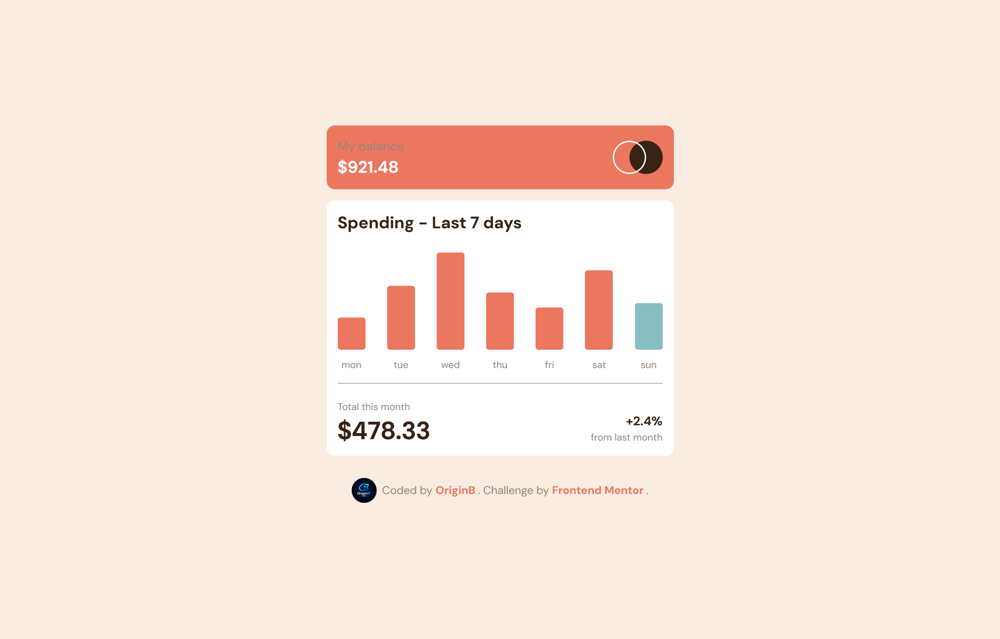
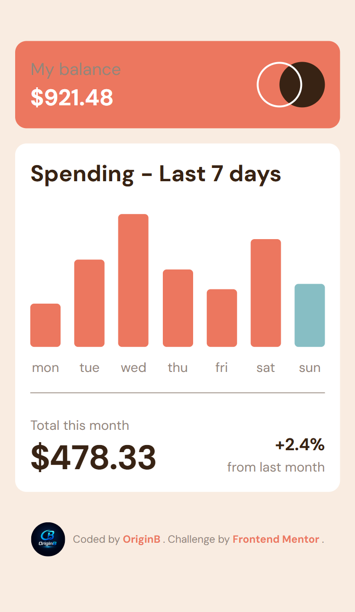

# 📊 Expenses Chart Component

A weekly expenses chart component built as a solution to the [Frontend Mentor](https://www.frontendmentor.io) "Expenses chart component" challenge, rendering a dynamic bar chart from JSON data with vanilla JavaScript.

🔗 **Live Demo:** [Add your live demo link here](https://origin-b.github.io/Frontend-Challenges-JS/ExpensesChartComponent/)

## 📸 Screenshot




> Replace `screenshot.jpg` with an actual screenshot of the project, placed in the same folder as this README (or update the path above).

---

## 🚀 Overview

The component fetches a week's worth of spending data from `data.json` and renders it as a bar chart, with each bar's height scaled relative to the highest value in the dataset, today's bar highlighted in a different color, and a tooltip showing the exact amount on hover.

### Built with

- **HTML5** — semantic markup
- **Tailwind CSS v4** — utility-first styling
- **Vanilla JavaScript (ES6+)** — async data fetching and DOM rendering
- **Google Fonts** — DM Sans

---

## ✨ Features & Engineering Decisions

### 1️⃣ Proportional bar heights relative to the max value

Each bar's height is calculated as a percentage of the highest amount in the dataset, then converted to a pixel value against a fixed chart height:

```js
let max = Math.max(...dataArr.map((e) => e.amount));
let amountPercentage = Math.trunc((ele.amount / max) * 100);
let height = (amountPercentage / 100) * 140;
```

This keeps the chart visually proportional regardless of the actual dollar amounts in the data.

### 2️⃣ Highlighting "today" dynamically

The current weekday is computed once using the `Intl`-backed `toLocaleString`:

```js
let todayName = new Date()
  .toLocaleString("en-US", { weekday: "short" })
  .toLowerCase();
```

and compared against each `day` field from the data to apply a distinct background color to today's bar — no hardcoded day, so the highlight stays correct on any date.

### 3️⃣ Hover tooltip via Tailwind's `group` utility

Each bar's exact amount is shown in a hidden tooltip `<span>` that becomes visible only on hover, using Tailwind's `group` / `group-hover:block` pattern — no JavaScript event listeners needed for the tooltip itself.

### 4️⃣ Inline `style` for bar height instead of a Tailwind class

Bar height is set via an inline `style="height: ...px"` rather than a Tailwind height utility, since the height value is fully dynamic per data point and can't be expressed as a fixed Tailwind class ahead of time.

---

## 📂 Project Structure

```
.
├── images/          # Logo and icons
├── data.json        # Weekly spending data (day, amount)
├── index.html        # Markup
├── index.js          # Data fetching + chart rendering logic
├── input.css          # Tailwind theme tokens
└── output.css         # Compiled Tailwind CSS
```

---

## 🔧 Getting Started

### Prerequisites

- [Node.js](https://nodejs.org/) and a package manager if you want to rebuild `output.css`
- Tailwind CSS v4 as a dependency

### Rebuilding the CSS

```bash
npx @tailwindcss/cli -i ./input.css -o ./output.css --watch
```

### Running the project

```bash
npx serve .
```

Or simply open `index.html` directly in a browser.

---

## 🙏 Acknowledgments

- Challenge by [Frontend Mentor](https://www.frontendmentor.io?ref=challenge)
