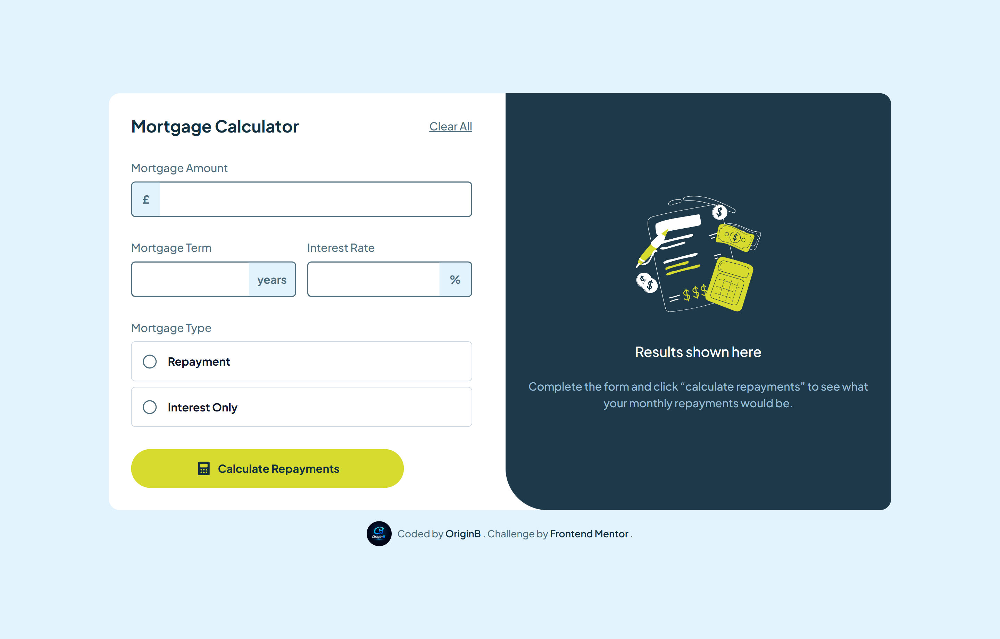
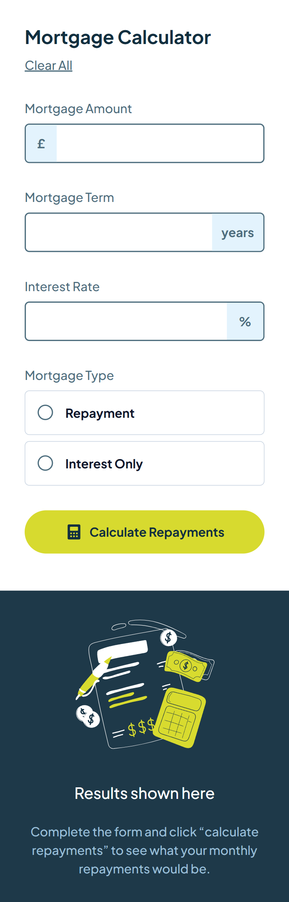

# 🏠 Mortgage Repayment Calculator

A mortgage repayment calculator built as a solution to the [Frontend Mentor](https://www.frontendmentor.io) "Mortgage repayment calculator" challenge, with full client-side form validation and two repayment formulas (repayment / interest-only).

🔗 **Live Demo:** (https://origin-b.github.io/Frontend-Challenges-JS/MortgageRepaymentCalculator/)

## 📸 Screenshot




> Replace `screenshot.jpg` with an actual screenshot of the project, placed in the same folder as this README (or update the path above).

---

## 🚀 Overview

The user fills in the mortgage amount, term, interest rate, and mortgage type, then the app validates every field, calculates monthly and total repayments using the correct financial formula for the selected type, and displays the results panel.

### Built with

- **HTML5** — semantic markup
- **Tailwind CSS v4** — utility-first styling, using `group`, `peer`, and `has-checked` state variants
- **Vanilla JavaScript (ES6+)** — form validation and repayment calculation logic
- **Google Fonts** — Plus Jakarta Sans

---

## ✨ Features & Engineering Decisions

### 1️⃣ A single state object driving validation and calculation

All form data lives in one object, with a dedicated `calc()` method attached to it:

```js
let mortgageObj = {
  amount: "",
  term: "",
  rate: "",
  type: "",
  calc: function () {
    /* ... */
  },
};
```

Validation (`check()`) and calculation (`calc()`) both read from and write to this same object, keeping the form's "truth" in one place rather than scattered across DOM reads.

### 2️⃣ Generic field validation loop

Instead of writing a separate `if` block per field, `check()` loops over every key in `mortgageObj` (skipping `calc` and handling the radio `type` field as a special case) and applies the same required/number rules to each:

```js
for (const k in mortgageObj) {
  if (k === "calc") continue;
  // ...shared validation rules applied per key
}
```

This keeps the validation logic DRY across three otherwise-identical numeric fields.

### 3️⃣ Two repayment formulas selected by mortgage type

The actual financial calculation branches based on the chosen radio option:

- **Interest-only:** `monthly = principal × monthlyRate`
- **Repayment:** the standard amortization formula `monthly = (P × r × (1+r)^n) / ((1+r)^n − 1)`

Both branches share the same formatting logic (`toLocaleString('en-GB', { minimumFractionDigits: 2, maximumFractionDigits: 2 })`) to consistently display currency with two decimal places.

### 4️⃣ Validation UI driven by Tailwind's `group` state classes

Error states are toggled by adding/removing a single `warn` class on each field's wrapping `.group` element. Every visual change — red border, red icon background, visible warning text — is handled declaratively through Tailwind's `group-[.warn]:*` variants in the HTML, with JavaScript only ever touching the one class:

```js
warnParent.classList.add("warn"); // or .remove('warn')
```

### 5️⃣ Custom radio buttons via `peer` and `has-checked`

The mortgage type radios are visually hidden (`sr-only peer`) while a styled sibling `<div>` reflects the checked state through `peer-checked:*` classes, and the whole label highlights via `has-checked:*` — a fully CSS-driven custom radio button with no extra JavaScript.

---

## 📂 Project Structure

```
.
├── images/          # Illustrations and icons
├── index.html        # Markup
├── index.js          # Form validation + repayment calculation logic
├── input.css          # Tailwind theme tokens
└── output.css         # Compiled Tailwind CSS
```

---

## 🔧 Getting Started

### Prerequisites

- [Node.js](https://nodejs.org/) and a package manager if you want to rebuild `output.css`
- Tailwind CSS v4 as a dependency

### Rebuilding the CSS

```bash
npx @tailwindcss/cli -i ./input.css -o ./output.css --watch
```

### Running the project

```bash
npx serve .
```

Or simply open `index.html` directly in a browser.

---

## 🙏 Acknowledgments

- Challenge by [Frontend Mentor](https://www.frontendmentor.io?ref=challenge)
