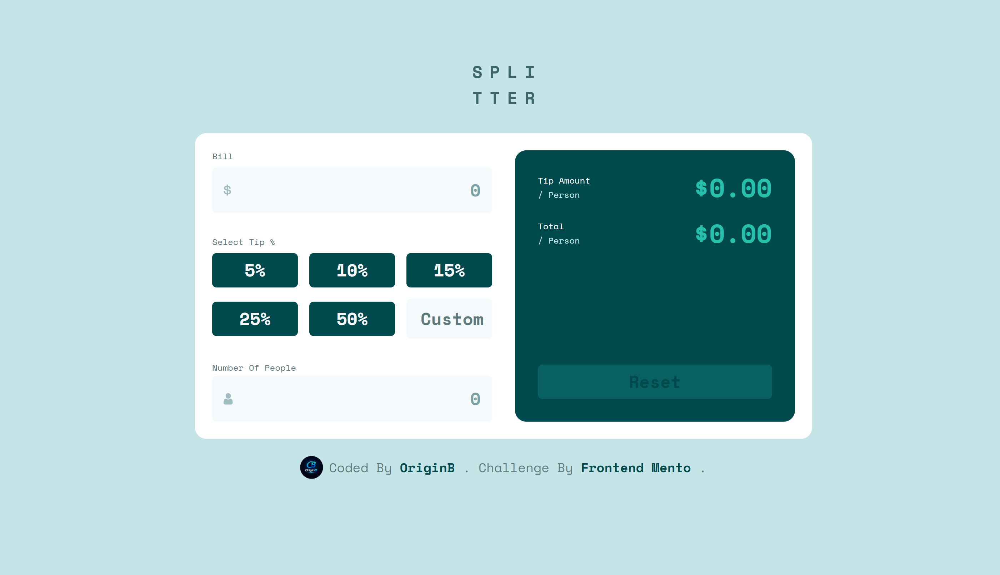
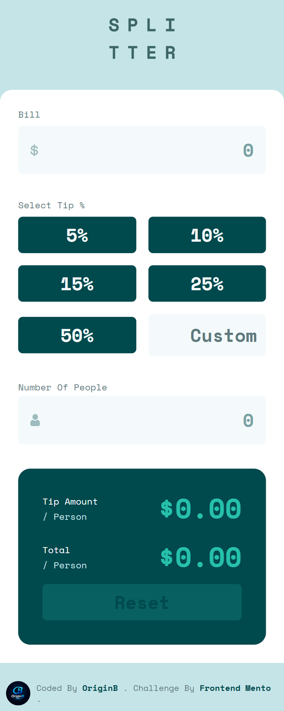

# Tip Calculator App

A simple, responsive **Tip Calculator** built as a [Frontend Mentor](https://www.frontendmentor.io) challenge. Users enter a bill amount, choose (or type) a tip percentage, and enter the number of people splitting the bill — the app instantly calculates the tip amount and total per person.




## 🔗 Links

- Live Demo: (https://origin-b.github.io/Frontend-Challenges-JS/TipCalculatorApp/)
- Frontend Mentor Challenge: (https://www.frontendmentor.io/challenges/tip-calculator-app-ugJNGbJUX)

## ✨ Features

- Calculate tip amount and total **per person**
- Choose from preset tip percentages (5%, 10%, 15%, 25%, 50%) or enter a custom percentage
- Input validation with inline error messages (no zero values, no non-numeric input)
- Reset button to clear all fields and results
- Fully responsive layout (mobile-first, with `md` and `lg` breakpoints)

## 🛠️ Built With

- Semantic **HTML5**
- **Tailwind CSS v4** (CSS-first config via `@theme`)
- Vanilla **JavaScript** (DOM manipulation, event delegation)
- Mobile-first responsive design

## 📁 Project Structure

```
.
├── index.html        # Markup
├── index.js           # App logic (calculations, validation, events)
├── input.css          # Tailwind source file (theme + custom utilities)
├── output.css         # Compiled Tailwind CSS (generated — do not edit directly)
├── images/            # Icons and logo assets
├── package.json        # Tailwind CLI dependency
└── README.md
```

## 🚀 Getting Started

1. Clone the repo
   ```bash
   git clone <repo-url>
   ```
2. Install dependencies (Tailwind CLI)
   ```bash
   npm install
   ```
3. Rebuild the CSS after editing `input.css`
   ```bash
   npx @tailwindcss/cli -i ./input.css -o ./output.css --watch
   ```
4. Open `index.html` in your browser (or use a Live Server extension).

## 🧠 What I Learned

- Using Tailwind v4's CSS-first configuration (`@theme`) instead of a `tailwind.config.js` file
- Creating custom Tailwind utilities with `@utility`
- Building form validation logic from scratch in vanilla JS
- Managing active/selected UI states by toggling classes instead of relying on a framework

## 👤 Author

- GitHub - [@Origin-B](https://github.com/Origin-B)

## 🙏 Acknowledgments

- Challenge provided by [Frontend Mentor](https://www.frontendmentor.io?ref=challenge)
